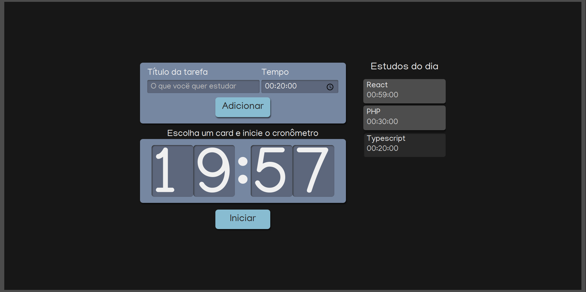

# Lista de estudos 

O projeto foi desenvolvido utilizando o <a href="https://legacy.reactjs.org/docs/getting-started.html" target="_blank">React</a> junto com typescript, cujo 
o objetivo era desenvolver um cronometro, que cronometrava dinamicamente de acordo com tempo de estudo de um item da lista de estudos.

## Tela desenvolvida
 


## Como rodar o projeto?

Você precisa ter o [Node](https://nodejs.org/en/), o [Git](https://git-scm.com/) e algum gerenciador de pacotes([NPM](https://docs.npmjs.com/downloading-and-installing-node-js-and-npm/) | [Yarn](https://classic.yarnpkg.com/lang/en/docs/install)) instalados em sua máquina.

```bash
1. Clone o repositório:
$ git clonehttps://github.com/Gabrielttbr/Lista-de-estudos-.git
2. Acesse a pasta e instale as dependências via terminal:
$ yarn / npm install
3. Inicie a aplicação em modo de desenvolvimento:
$ yarn start / npm run start
4. O servidor será aberto em http://localhost:3000
```
